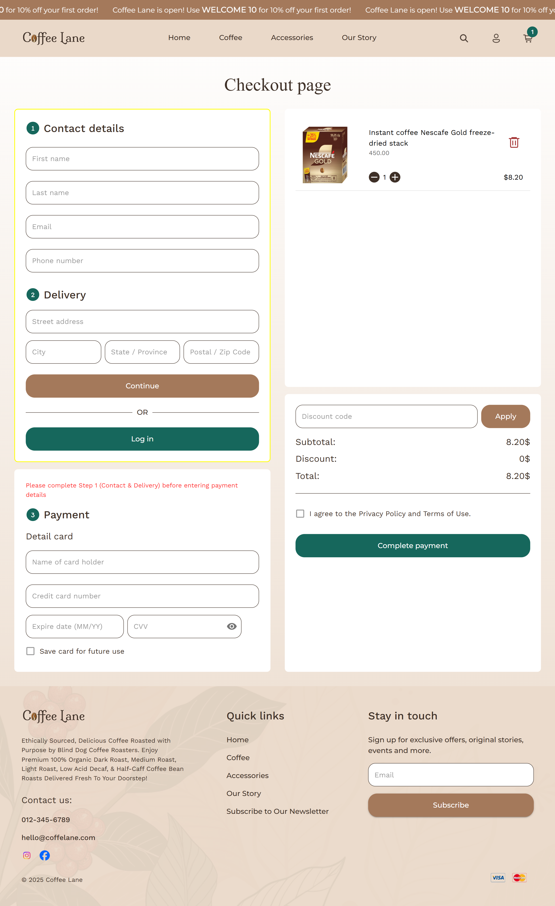

# Coffelane-online-store

Coffelane-online-store — is an online coffee shop optimized for the desktop version, where users can browse products, add them to their cart, and place an order.

## 🔗 Project link
[View the working version](https://coffelanecoffeshop.vercel.app/)

## 🚀 Technologies
- Frontend: React, Redux Toolkit, Material-UI
- Deployment: Vercel
- Tools: GitHub

## 📸 Screenshots (desktop)
Home page:  

Catalog Page:  

Cart and checkout:  

## ⚡ Peculiarities
- Product catalog with filtering  
- Adding products to cart and placing an order
